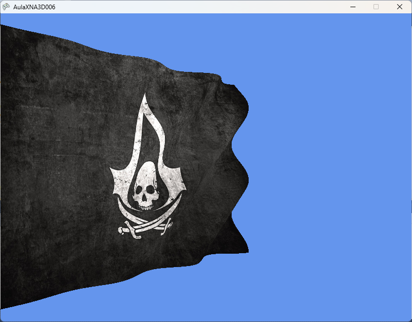

# XNA_006_VERTEXSHADER

Este repositório contém o projeto didático **AulaXNA3D006**, o sexto e último passo no estudo básico de Computação Gráfica 3D utilizando a linguagem **C#** e o framework **Microsoft XNA Game Studio 4.0**.

O objetivo deste projeto é ensinar o conceito de **Vertex Shaders Programáveis**, demonstrando como manipular a posição geométrica de vértices diretamente na GPU (placa de vídeo) para criar efeitos de animação procedimental, como uma bandeira ondulando ao vento.

---

## 📸 Resultado Esperado



*Nota: A imagem acima representa o resultado da malha deformada dinamicamente pelo Vertex Shader aplicando a textura da bandeira.*

---

## 🛠️ Como o Projeto Funciona

O projeto demonstra a criação de uma malha 3D densa em C# e a sua deformação em tempo real via hardware:

### 1. O Shader em HLSL: [`MotionEffect.fx`](AulaXNA3D006/AulaXNA3D006/AulaXNA3D006Content/Effects/MotionEffect.fx) (Novo)
O shader personalizado é responsável pelo efeito de deformação:
* **VertexShaderFunction**: Antes de aplicar a transformação final de coordenadas (Mundo, Visualização e Projeção), o shader de vértice altera a posição Z de cada vértice da malha em tempo real baseado no parâmetro `time` e na própria posição X e Y do vértice:
  ```hlsl
  float envelope = (input.Position.x + 10.0) / 20.0;
  input.Position.z += sin(time - input.Position.x + input.Position.y) * envelope;
  ```
  Isso cria uma onda senoidal que se propaga pela malha. O valor `envelope` escala linearmente a amplitude da oscilação de `0.0` (na ponta esquerda `X = -10`, presa ao mastro) até `1.0` (na ponta direita `X = 10`, solta ao vento), criando uma deformação de bandeira muito mais leve e otimizada para a GPU.
* **PixelShaderFunction**: Mapeia a textura da bandeira no plano deformado gerando a renderização final dos pixels.

### 2. A Malha Grid: [`_Quad.cs`](AulaXNA3D006/AulaXNA3D006/AulaXNA3D006/_Quad.cs)
Diferente das aulas anteriores que usavam um retângulo simples (de 4 vértices), a simulação de ondas requer maior resolução geométrica (detalhamento da malha). 
* **Divisão de Vértices**: Cria uma grade densa de **150 linhas por 200 colunas (30.000 vértices)** utilizando a estrutura `VertexPositionTexture`.
* **Buffers Otimizados (VRAM)**:
  * **No Construtor**: Preenche o `VertexBuffer` (`vBuffer`) e o `IndexBuffer` (`iBuffer`) uma única vez com os dados da malha, enviando-os para a memória dedicada da placa de vídeo (VRAM).
  * **No Desenho (`Draw`)**: Em vez de fazer transferências lentas de arrays da CPU a cada frame (`DrawUserIndexedPrimitives`), vincula os buffers de hardware e desenha usando **`DrawIndexedPrimitives`**, aproveitando ao máximo a memória de vídeo (VRAM) quando o processamento de animação fica a cargo da GPU (Vertex Shader).
* **Update**: Incrementa a variável `time` com base no tempo decorrido do jogo (`TotalSeconds`), que controla a velocidade de propagação das ondas.

### 3. A Classe Principal: [`Game1.cs`](AulaXNA3D006/AulaXNA3D006/AulaXNA3D006/Game1.cs)
* Carrega a textura da bandeira ([`flagACBF.jpg`](AulaXNA3D006/AulaXNA3D006/AulaXNA3D006Content/Textures/flagACBF.jpg)) e o shader.
* Configura o Rasterizer State para `CullMode.None` para que a bandeira seja visível por ambos os lados conforme ela ondula.
* Executa a atualização da física/tempo e desenha a malha passando a câmera interativa.

---

## 💻 Requisitos do Sistema

* **Sistema Operacional**: Windows 7, 8, 10 ou 11 (com runtimes do XNA e DirectX 9 instalados).
* **IDE**: Microsoft Visual Studio 2010.
* **Framework**: Microsoft XNA Game Studio 4.0.
* **Dependência**: .NET Framework 4.0 Client Profile.

---

## 🚀 Como Executar

1. Clone este repositório:
   ```bash
   git clone https://github.com/FCA-GAMEDEV/XNA_006_VERTEXSHADER.git
   ```
2. Abra o arquivo `AulaXNA3D006.sln` localizado na pasta `AulaXNA3D006` utilizando o Visual Studio 2010.
3. Pressione `F5` para compilar e rodar a simulação da bandeira ondulando no espaço 3D.
